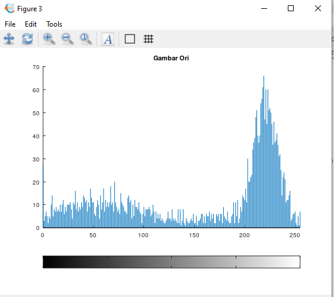
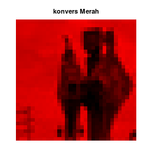
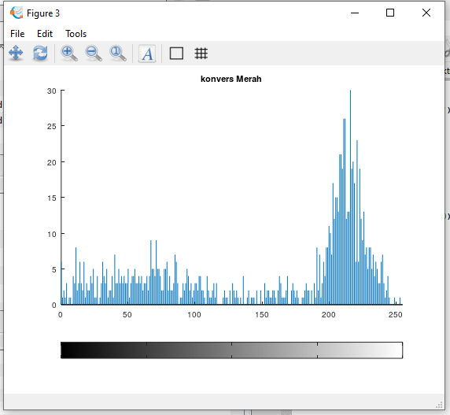
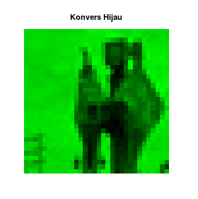
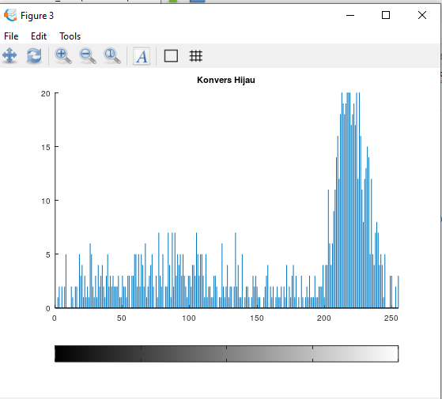
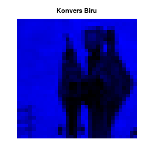
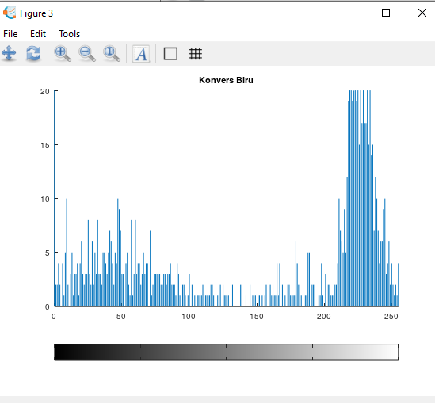
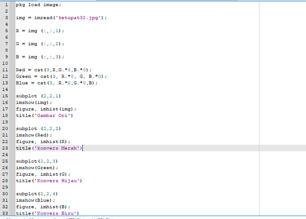

# Nama : Naila Hasanah
# NIM  : 2110131220007

# Tugas 2 Pemprosesan Citra Digital

 

# Eksplorasi Octave dengan Package Image
 

Langkah pertama adalah dengan membuat package image terlebih dahulu.Ketik **pkg load image** pada command windows.Jika ingin mengecek pack image apakah sudah ada atau belum bisa dengan mengetik **pkg list**.

### Berikut contoh Eksplorasi Octave dengan Package Image :

## 1.Gambar Asli dan Histogram

    

    

## 2.Gambar Read dan Histogram

    

    

## 3.Gambar Green dan Histogram

    

    

## 4.Gambar Blue dan Histogram

    

    

 

### Dari hasil tersebut dapat disimpulkan bahwa Gambar terbagi menjadi 3 layer yaitu *merah(read)*,*hijau(green)* dan *biru(blue)*.

 

# Kode Editor untuk membuat  Package Image

    

 

## Fungsi Kode

- Imread (images read) digunakan untuk membaca citra menjadi sebuah data matriks.
- Imshow (images show) digunakan untuk menampilkan data matriks menjadi sebuah gamba
- Imhist Adalah suatu perintah yang berfungsi untuk menampilkan suatu histogram dari sebuah citra.Histogram adalah tampilan grafis dari tabulasi frekuensi yang digambarkan dengan grafis batangan manifestasi data benning.