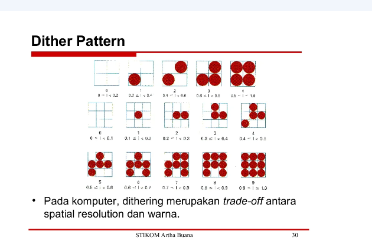

# Nama : Naila Hasanah
# NIM  : 2110131220007

## Tugas 3 PCD

 
 

# Metode Gray Scale

Grayscale adalah warna perpaduan antara hitam dengan putih, yang mana graycale nantinya juga memiliki tingkat derajat keabuan tersendiri. 

Berikut tiga macam metode algoritma untuk mengubah nilai R G B menjadi Grayscale : 

1 . Lightness

Algoritmanya adalah mencari nilai tertinggi dan terendah dari nilai R G B, kemudian nilai tertinggi dan terendah tersebut dijumlahkan lantas dikalikan dengan 0.5. 

Secara matematis dapat dirumuskan :

Grayscale = (max(R,G,B)) + (min(R,G,B)) * 0.5

2 . Average

Algoritmanya adalah dengan menjumlahkan seluruh nilai R G B, kemudian dibagi 3, sehingga diperoleh nilai rata-rata dari R G B, nilai rata-rata itulah yang dapat dikatakan sebagai grayclase. 

Rumus matematisnya adalah :

Grayscale = (R + G + B) / 3 

3 . Luminosity 

Algoritmanya adalah dengan mengalikan setiap nilai R G B dengan konstanta tertentu yang sudah ditetapkan nilainya, kemudian hasil perkalian seluruh nilai R G B dijumlahkan satu sama lain. 

Rumus matematisnya adalah :

Grayscale = (0.3 * R) + (0.59 * G) + (0.11* B)

**Berikut kode Editor untuk Membuat Grayscale :**

    

**Eksplorasi Grayscale dengan Metode Lightness,average,Luminosity :**

    

## Histogram :

    

 
 

# Materi Halftoning, Patterning, Dithering

# Halftoning 

Halftoning atau halftoning analog adalah proses yang mensimulasikan nuansa abu-abu dengan memvariasikan ukuran titik-titik hitam kecil yang diatur dalam pola yang teratur. Teknik ini digunakan dalam printer, serta industri penerbitan. Jika Anda memeriksa sebuah foto di koran, Anda akan melihat bahwa gambar itu terdiri dari titik-titik hitam meskipun tampaknya terdiri dari abu-abu. Hal ini dimungkinkan karena integrasi spasial yang dilakukan oleh mata kita. Mata kita memadukan detail halus dan merekam intensitas keseluruhan .

[1]. Halftoning digital mirip dengan halftoning di mana gambar didekomposisi menjadi kotak sel halftone. Elemen (atau titik yang digunakan halftoning dalam mensimulasikan nuansa abu-abu) dari sebuah gambar disimulasikan dengan mengisi sel halftone yang sesuai. Semakin banyak jumlah titik hitam dalam sel halftone, semakin gelap sel tersebut. 
 Misalnya, pada Gambar 4, sebuah titik kecil yang terletak di tengah disimulasikan dalam halftoning digital dengan mengisi sel halftone tengah; demikian juga, titik ukuran sedang yang terletak di sudut kiri atas disimulasikan dengan mengisi empat sel di sudut kiri atas. Titik besar yang menutupi sebagian besar area pada gambar ketiga disimulasikan dengan mengisi semua sel halftone.

    

Tiga metode umum untuk menghasilkan gambar halftoning digital adalah:

- membuat pola
- kebingungan
- difusi kesalahan

# Patterning

Patterning adalah yang paling sederhana dari tiga teknik untuk menghasilkan gambar halftoning digital.patterning dikenal sebagai pola melibatkan penggantian setiap pixel dengan pola yang diambil dari <b>font binner</b>. 
 Ini menghasilkan gambar yang memiliki resolusi spasial lebih tinggi daripada gambar sumber. Jumlah sel halftone citra keluaran sama dengan jumlah piksel citra sumber. Namun, setiap sel halftone dibagi lagi menjadi kotak 4x4. Setiap nilai piksel input diwakili oleh jumlah kotak terisi yang berbeda dalam sel halftone. Karena kisi 4x4 hanya dapat mewakili 17 tingkat intensitas yang berbeda, gambar sumber harus dikuantisasi.

Gambar 4.2 menunjukkan matriks pola rekursif Rylander, yang akan digunakan dalam daftar 4.1, dan contoh operasi pola.

    

NAMA

pattern - menghasilkan gambar halftoning digital dari gambar input melalui pola.

RINGKASAN

pola(nama_file_input, nama_file_output)

KETERANGAN

pattern menghasilkan gambar halftoning digital dari gambar input menggunakan teknik pola. Pola program membaca gambar input, mengkuantisasi nilai piksel, dan memetakan setiap piksel ke pola yang sesuai. Gambar yang dihasilkan 16 kali lebih besar dari aslinya. Gambar yang dihasilkan ditulis ke file output sebagai file TIFF. Sebuah kata peringatan: "pola" membutuhkan banyak perhitungan, gambar berukuran kurang dari 100x100 direkomendasikan.

CONTOH

pola('PAINTER.TIF', 'pa_ptr.tif')
Contoh ini menghasilkan gambar halftoning digital dari PAINTER menggunakan teknik pola (Gambar 4.4)

    

# Dithering

Teknik lain yang digunakan untuk menghasilkan gambar halftoning digital adalah dithering. Tidak seperti pola, dithering membuat gambar keluaran dengan jumlah titik yang sama dengan jumlah piksel pada gambar sumber. Dithering dapat dianggap sebagai thresholding gambar sumber dengan matriks gentar. Matriks diletakkan berulang kali di atas gambar sumber. Dimanapun nilai piksel gambar lebih besar dari nilai dalam matriks, titik pada gambar output diisi. Masalah dithering yang terkenal adalah menghasilkan artefak pola yang diperkenalkan oleh matriks ambang batas tetap. Dithering tidak mengubah ukuran,tetapi detailnya.

Gambar 4.5 menunjukkan contoh operasi dithering.

    

    

 

## Menentukan Pola Patterning dan Dithering

- Patterning
 
 

    

 Untuk Menentukan pola patterning dengan menghitung banyaknya font binner terlebih dahulu kemudian ditambahkan 1.Pola yang ada pada patterning tidak boleh sama dan pola yang sudah ada tidak digunakan lagi.

- Dithering

    

 

Penggunaan dithering yang umum adalah mengonversi gambar skala abu-abu menjadi hitam putih.Sehingga kerapatan titik-titik hitam pada gambar baru mendekati tingkat keabuan rata-rata pada aslinya.

## Cara menentukan matriks treshold pada dithering
Thresholding merupakan salah satu metode segmentasi citra di mana prosesnya didasarkan pada perbedaan derajat keabuan citra.

Algoritme mengurangi jumlah warna dengan menerapkan peta ambang M ke piksel yang ditampilkan, menyebabkan beberapa piksel berubah warna, tergantung pada jarak warna asli dari entri warna yang tersedia di palet yang dikurangi.

Peta ambang batas datang dalam berbagai ukuran, yang biasanya merupakan kekuatan dua:

    

Peta dapat diputar atau dicerminkan tanpa mempengaruhi efektivitas algoritma. Peta ambang batas ini (untuk sisi dengan panjang pangkat dua ) juga dikenal sebagai matriks indeks atau matriks Bayer . 

## Kenapa pola dither lebih kecil tidak sebagus pola dither yang lebih bagus ukurannya.

Citra keluaran dari proses ordered dithering menunjukkan kualitas yang lebih baik dibandingkan dengan metode ambang batas (thresholding). Perbedaan antara keluaran yang dihasilkan antara citra menggunakan 2x2 matriks dithering dan 4x4 matriks dithering terletak pada sensitifitas nilai piksel aslinya. Citra yang dihasilkan dari penggunaaan matriks 2x2 memiliki pola halftone yang kurang dibandingkan dengan citra yang diproses menggunakan matriks dithering 4x4.Karena itu hasil dari citra dengan 2x2 matriks dithering memiliki banyak daerah dengan pola yang sama, seperti pada bagian latar belakang, rambut, dan hidung, meskipun pada daerah ini mengandung lebih banyak jenis nilai piksel. 

