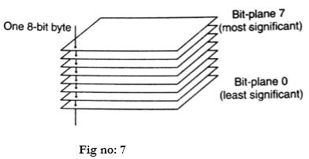
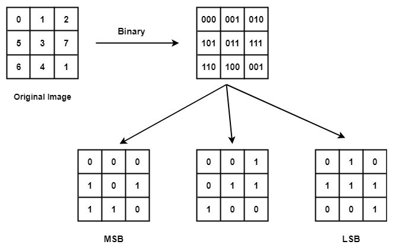
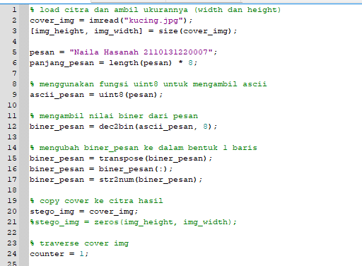
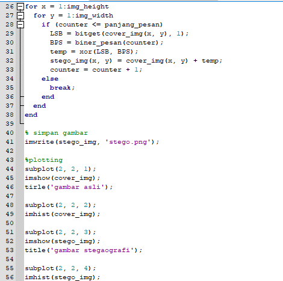
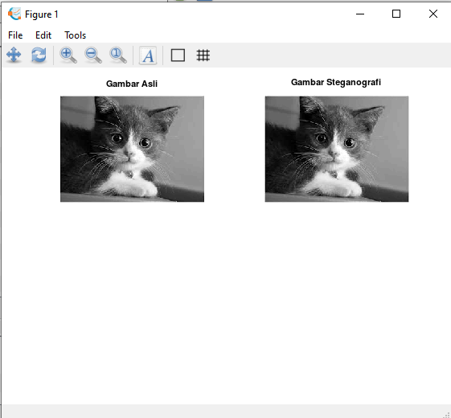
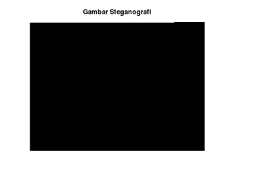

# Nama : Naila Hasanah
# NIM  : 2110131220007
# Tugas 5 PCD : Bit Plane Slicing Dan Steganografi

 
 

# Bit-Plane Slicing

    

Secara digital sebuah gambar merupakan representasi dari sejumlah pixel.
Pixel ini dapat diekspresikan lebih lanjut dalam bentuk bit.
Bit-plane slicing merupakan metode yang digunakan untuk melihat
konstribusi atau pengaruh tiap bit penyusun citra.

    

Untuk citra 8 bit, pada dasarnya tiap intensitas yang nilainya dalam format
decimal, bisa dipecah menjadi bit-bit dalam format biner. Misalnya, sebuah
pixel dengan intensitas 245 (decimal) bila dijadikan biner adalah 11110101.
Bilangan biner yang berada disisi paling kanan adalah last significant bit.
Sedangkan bilangan biner yang berada disisi paling kiri adalah most significant bit.

Tiga tujuan utama dari bit plane slicing adalah:

- Mengonversi gambar tingkat keabuan menjadi gambar biner.
- Mewakili gambar dengan bit lebih sedikit dan menyesuaikan gambar ke ukuran yang lebih kecil
- Meningkatkan gambar dengan memfokuskan.

## Kode Program :

- Kita dapat melakukan metode bit-plane slicing pada citra grayscale dengan
menggunakan fungsi bitget.

## Hasil Program:

# Steganografi

Steganografi merupakan teknik menyembunyikan pesan di dalam suatu media penyisipan pesan atau cover image, sehingga keberadaan pesan rahasia yang disisipkan tidak dapat dilihat secara langsung.Tujuan dari steganografi adalah merahasiakan atau menyembunyikan keberadaan dari sebuah pesan tersembunyi atau sebuah informasi.
Data yang disembunyikan dapat berupa:
- Gambar
- Teks
- Suara
- Dll

## Adapun langkah-langkah yang dilakukan dalam menerapkan metode steganografi adalah:

- Ubah citra warna ke dalam citra grayscale.
- Ubah pesan yang akan disisipkan ke dalam bentuk biner.
- Cek untuk setiap piksel yang ada pada citra, dan lakukan:
-  Ambil nilai LSB pada citra
- Ambil nilai bit pesan yang akan disisipkan
- Jika nilai sama, tambahkan 0 ke dalam citra output, jika tidak tambahkan 1.
- Simpan gambar.

 

## Eksplorasi metode steganografi terhadap citra gray_scale dengan menggunakan Octave

## Kode Program :

    

    

## Hasil Program:

    

## isi pesan rahasia

    

