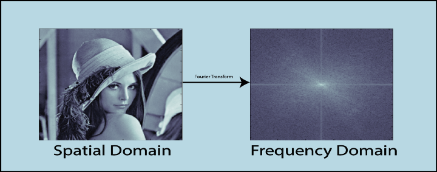
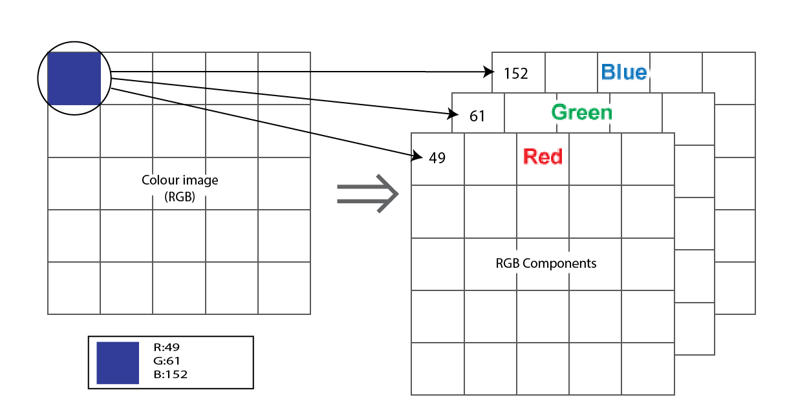
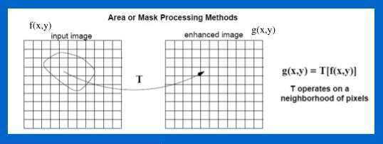
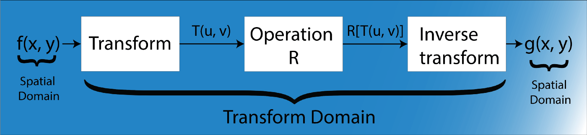

# Nama : Naila Hasanah
# NIM  : 2110131220007
## Tugas 6 PCD : Image Enhancement Domain Spasial Dan Domain Frekuensi.

 
 

# Image Enhancement 

Image enhancement adalah metode yang umum digunakan dalam meningkatkan kualitas citra. Perbaikan citra (image enhancement) bertujuan untuk mendapatkan tampilan citra dengan bentuk visualisasi yang lebih baik, dengan cara memaksimalkan kandungan informasi di dalam citra masukan.

Ruang lingkup dalam Peningkatan Citra atau Image Enhancement ada dua, yaitu: Spasial dan Frekuensi. Spasial mencakup semua teknik memanipulasi citra dalam domain spasial bidang citra. Sedangkan frekuensi memanipulasi citra dalam domain frekuensi dengan teknik transformasi Fourier.

    

# Spatial  Domain

 Dalam metode domain frekuensi didasarkan pada Transformasi Fourier dari suatu gambar. Secara kasar, istilah frekuensi dalam sebuah gambar menceritakan tentang laju perubahan nilai piksel.

 Suatu citra dapat direpresentasikan dalam bentuk matriks 2D dimana setiap elemen matriks merepresentasikan intensitas piksel. Keadaan matriks 2D yang menggambarkan distribusi intensitas suatu gambar disebut Domain Spasial.

    

Setiap intensitas piksel direpresentasikan sebagai f(x,y) di mana x,y adalah koordinat piksel dalam matriks 2D. Operasi yang berbeda dilakukan dalam nilai ini. Misalnya- operasi T(katakanlah, penambahan 5 ke semua piksel) dilakukan dalam f(x,y) yang berarti bahwa setiap nilai piksel bertambah 5. Ini dapat ditulis sebagai berikut :

    

g(x,y) = T[f(x,y)]

Keterangan :

f(x, y) = Citra original/citra input 
g(x, y) = Citra baru yang dimodifikasi/citra output 
T = Sebuah transformasi yang diterapkan untuk mendapatkan citra baru (g(x,y)) 

di mana, g(x,y) adalah intensitas baru setelah menambahkan 5 ke f(x,y).
Peningkatan Gambar Menggunakan Pemfilteran Domain Spasial
Istilah spasial, merujuk pada piksel yang merupakan elemen terkecil dari suatu citra. Semua perubahan langsung mengeksekusi nilai-nilai ini. Domain spasial dapat ditulis dalam notasi ini:

Dalam domain spasial, bentuk paling sederhana dari T berukuran 1×1. Dalam hal ini, g(x,y) hanya bergantung pada nilai f(x,y), dan T menjadi tingkat keabuan. Lingkungan yang lebih besar juga bisa ada. Mereka dikenal sebagai mask yang mungkin berbeda dalam implementasinya seperti filter, kernel, template atau windows .

Seperti yang dijelaskan, gambar skala abu-abu digunakan sebagai input ke algoritma. Gambar RGB (Merah Hijau Biru) diperoleh dalam tugas akuisisi. Gambar-gambar ini perlu diubah menjadi gambar skala abu-abu. Konversi citra input ke grayscale bertujuan untuk meminimalkan varians antar citra yang disebabkan oleh warna subjek yang berbeda. Jika algoritma dioptimalkan untuk warna tertentu, akan sangat sulit untuk bekerja dengan warna lain. Oleh karena itu dengan mengubah gambar RGB menjadi gambar grayscale, dimungkinkan untuk memiliki satu input format standar.

# Domain Frekuensi

Dalam metode domain frekuensi didasarkan pada Transformasi Fourier dari suatu gambar. Secara kasar, istilah frekuensi dalam sebuah gambar menceritakan tentang laju perubahan nilai piksel.

    

Metode-metode image enhancement dalam ranah frekuensi dilakukan dengan mengubah citra terlebih dahulu dari ranah spasial ke ranah frekuensi, baru kemudian memanipulasi nilai-nilai frekuensi tersebut.

Metode diantaranya ialah:

- Transformasi fourier

Tranformasi fourier adalah suatu model transformasi yang memindahkan domain spasial atau domain waktu menjadi domain frekuensi. Dengan menggunakan transformasi fourier, sinyal atau citra dapat dilihat sebagai suatu objek dalam domain frekuensi. Analisis dalam domain frekuensi banyak digunakan seperti filtering.

# Perbedaan antara domain spasial dan domain frekuensi

- Dalam domain spasial, berurusan dengan gambar apa adanya. Nilai piksel gambar berubah sehubungan dengan pemandangan.
- Sedangkan dalam domain frekuensi, berurusan dengan laju perubahan nilai piksel dalam domain spasial.

**Domain Spasial: Input -> Pemrosesan Gambar -> Output**

**Domain Frekuensi: Frekuensi + Distribusi -> Pemrosesan Gambar -> Transformasi Invers -> Keluaran**
